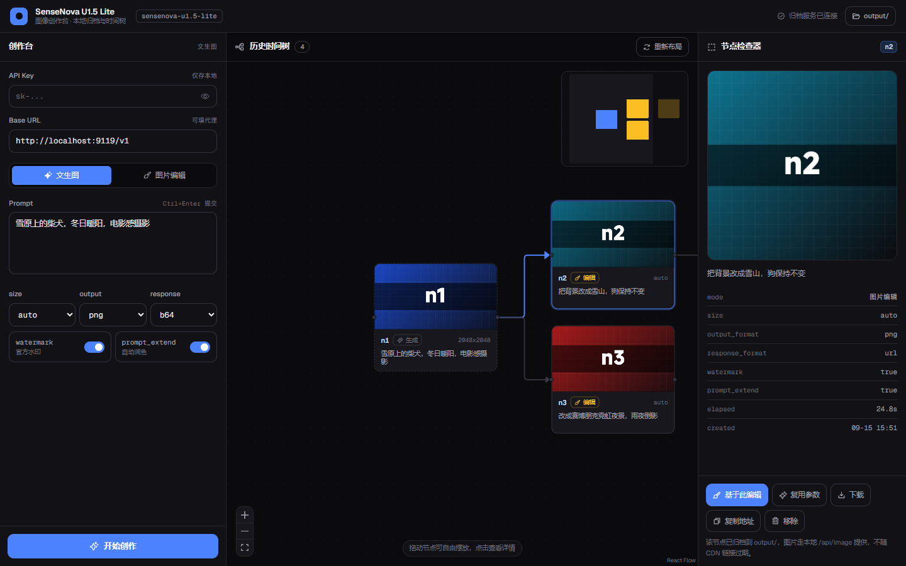
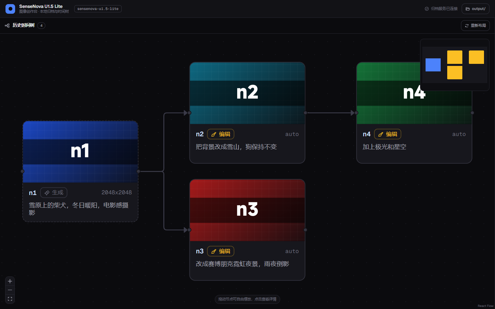
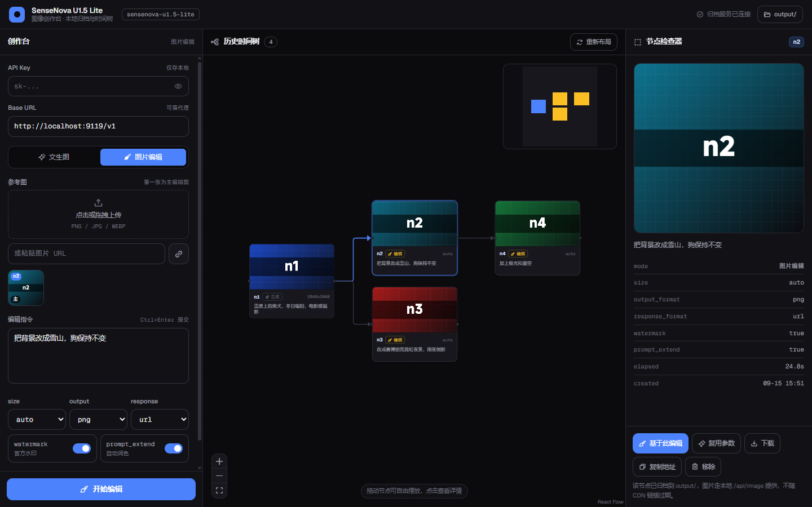

# SenseNova U1.5 Lite · 图像创作台

[](LICENSE)

[English](README.md) · **中文**

基于 [SenseNova U1.5 Lite](https://platform.sensenova.cn/docs)（`sensenova-u1.5-lite`，Neo-unify 架构）的图像创作工具：**文生图 / 图片编辑**，每张结果自动本地归档，并用**可拖拽的时间树**做类 git 的分支回溯。



## 界面

三段式布局，全视口无页面滚动条：

| 区域 | 内容 |
|------|------|
| 顶栏 | 品牌、模型标识、归档服务连接状态、`output/` 入口 |
| 左 · 创作台 | API Key、Base URL、模式切换、参考图、Prompt、参数、生成按钮 |
| 中 · 历史时间树 | React Flow 画布，节点可拖动、缩放、平移，带缩略图与小地图 |
| 右 · 节点检查器 | 选中节点的大图、完整参数、操作（基于此编辑 / 复用参数 / 下载 / 移除） |

### 时间树：可拖拽的生成历史



每张结果图是一个节点。文生图是根节点，图片编辑挂在参考图所属节点之下，因此能像 git 一样从任意历史节点开出分支。节点可自由拖动摆放，也能缩放、平移、小地图定位。

### 从任意节点分支编辑



在树上点一个节点，右侧检查器点「基于此编辑」，参考图与 prompt 自动回填，本次编辑会挂在所选节点之下，形成新分支。

## 技术栈

- **Vite + React 19** — 组件拆分，构建产物 `dist/`
- **@xyflow/react（React Flow）** — 时间树画布，节点原生可拖拽、缩放、平移、小地图
- **@dagrejs/dagre** — 自动树布局（左→右），「重新布局」一键复位
- **Tailwind CSS v4** — 设计令牌（`@theme`）
- **@phosphor-icons/react** — 图标（不使用 emoji）
- **zustand** — 跨面板状态
- **@fontsource-variable/geist** — 自托管 Geist / Geist Mono

## 功能

- **文生图** — `POST /v1/images/generations`
- **图片编辑** — `POST /v1/images/edits`（独立接口，必须带参考图）
- 参数：`size`（auto + 6 档 2K/4K 常量）、`output_format`、`response_format`、`watermark`、`prompt_extend`、`n=1`
- **本地归档** — 每张结果落入 `output/`，索引在 `output/tree.json`；服务端下载图片，规避 CDN 链接 24h 失效与浏览器 CORS
- **时间树（类 git）** — 文生图是根节点，图片编辑挂在参考图所属节点之下。可在任意历史节点「基于此编辑」开出新分支，非线性演进
- API Key 与参数存 localStorage

## 快速开始

```bash
npm install
npm start          # 构建产物 + 归档 API + 同源代理，自动开浏览器
```

打开后在页面填入 [控制台](https://platform.sensenova.cn/console/keys) 的 `sk-` 密钥即可。

### 开发模式（热更新）

```bash
npm start          # 一个终端：归档 API + 代理（9119）
npm run dev        # 另一个终端：Vite dev server（5173，自动代理 /api 与 /v1）
```

改前端代码用 `npm run dev` 更快；改 `serve.js` 需重启 `npm start`。发布前跑 `npm run build`。

## 目录结构

```
web/
  index.html              Vite 入口
  src/
    main.jsx              入口（字体、React Flow 样式）
    App.jsx               布局外壳、顶栏、Toast
    store.js              zustand 状态（配置 / 生成 / 归档 / 分支）
    api.js                接口封装（/api/* 与官方图片接口）
    theme.css             设计令牌 + React Flow 暗色覆盖
    components/
      ControlPanel.jsx    左：创作台
      TreeGraph.jsx       中：React Flow 时间树（dagre 布局）
      ImageNode.jsx       树节点卡片
      Inspector.jsx       右：节点检查器
serve.js                  本地服务：dist/ + /api 归档 + /v1 代理
proxy.js                  纯 CORS 代理（供双击静态文件场景）
vite.config.mjs           Vite 配置（root=web，outDir=../dist，dev 代理）
docs/                     README 截图
output/                   生成图片归档（含 tree.json，已 gitignore）
```

## 归档 API（serve.js 提供）

| 端点 | 说明 |
|------|------|
| `POST /api/save` | 归档结果图。body：`{mode, prompt, params, parentId, imageBase64 \| imageUrl}` |
| `GET /api/tree` | 返回全部节点（时间树索引） |
| `GET /api/image/<id>` | 返回节点图片（本地永久，不随 CDN 过期） |
| `DELETE /api/node/<id>` | 从树中移除节点（仅移除索引，磁盘文件保留，避免破坏其它分支） |
| `GET /output/` | 归档目录的图片浏览页 |

## 端口

默认 `9119`（服务与代理）。可用环境变量改：`PORT=8080 npm start`。
dev 模式 Vite 默认 `5173`。

## License

MIT License. See [LICENSE](LICENSE).

采用 MIT 许可证，见 [LICENSE](LICENSE)。**英文版为正式文本（authoritative）**，中文参考译文见 [LICENSE.zh-CN.md](LICENSE.zh-CN.md)；如两者有歧义，以英文版为准。

Copyright (c) 2026 Chuyuxuan0v0
